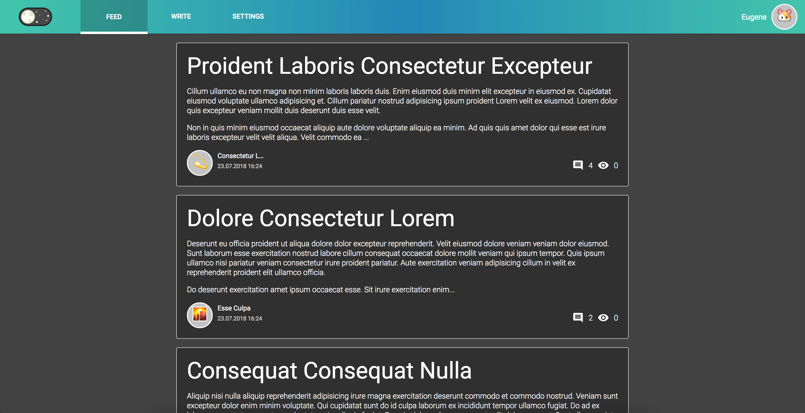

## React Mobx Typescript example app


**Demo:** [simple-mobx-blog.surge.sh](http://simple-mobx-blog.surge.sh/)

**Storybook:** [simple-mobx-blog-storybook.surge.sh](http://simple-mobx-blog-storybook.surge.sh/)

To run it locally just clone this repo and run:
```
yarn
yarn start
```

To run snapshot tests and list use:
```
yarn test
yarn lint
```

To run/build storybook:
```
yarn storybook
yarn build-storybook
```


